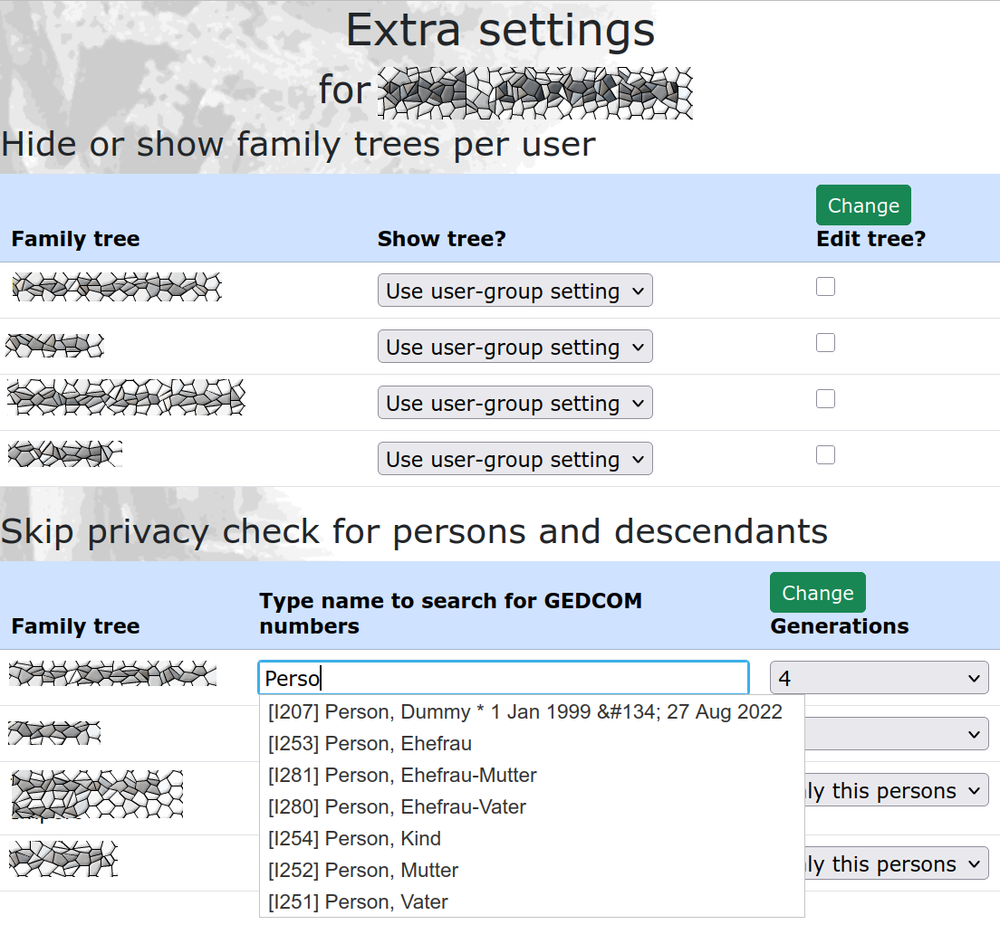

# HuMo-gen Server

>
> HuMo-gen Server is free and open-source genealogy software.
>
> It's a fork of the software project HuMo-genealogy, developed and 
> maintained by Huub Mons and others for more than two decades. You will find
> all information [here](https://github.com/HuubMons/HuMo-genealogy/).
 
The "Server" version puts its focus on a reliable code base that 
can be used out in the World Wide Web as a stable and secure platform 
on hosting environments running Linux machines with Apache and/or Nginx. 
HuMo-gen Server is not tested on Windows, nor on iOS or any Docker solutions.  
The code base is 6.7.9a of HuMo-genealogy extended by useful new 
features and a bunch of code and interface cleanups along with bug fixes. 
You will find a list of differences below.

Berlin, February 2025
Christian Seel

## Differences HuMo-gen Server (HGS) to original HuMo-genealogy (HGO)
- HuMo-gen-Server uses its own code to easily **secure media files** (pictures,
movies, documents). See HOWTO below. (HGO: lot of bugs and security issues)
- Use of **thumbnails** (create and display) can be switched on/off 
**by family tree** (HGO: feature not implemented)
- Picture **resize on upload** can be **disabled** or maximum resolution 
values can be set. (HGO: always on, fixed values)
- View/rename thumbnails function displays **all connections** to database (HGO: only 
persons)
- Add function to **delete files** that are not used in database (HGO: feature 
not available)
- **Categories** are widely **rebuild**: 
    - Free category name up to 30 characters (HGO: 2 character filename suffix 
or folder)
    - Free amount of categories electable (HGO: one Category per file)
    - Three default categories: persons, families, sources (HGO: persons only)
    - Categories set up by tree (HGO: global)
    - Category selection for media files added to data editors of person,
 family and source (HGO: Category not changeable)
    - Category selection can be exported and importet via GEDCOM files (using 
program specific tag)
- **GLightbox updated** to 3.20
- Player **plyr.io reintegrated to lightroom gallery** for mp4 and webm. (HGO: 
Player not used, playback depends on browser capabilities)
- Player plyr.io **completely localized** (no links to CDN)
- Privacy protection can be set to **Stealth Mode** to remove protected persons 
completely from all output in front end. (HGO: only anonymization possible)
- Specified branches of the tree can be defined to be viewed without privacy 
protection. This front end feature is set up by user.
- Enhanced **search for geodata** with OpenStreetMap in back end. (HMO: feature
is broken and a lot of JS-code missing)

## Removed or cleanup
- Global option to _enable automatic thumbnail generation_ removed. Reason: Thumbnail
settings moved to tree pictures settings.
- Detection of image libraries removed from admin start page
- Picture path can only be set at one place in back-end (HGO: four places). 
- Function _create all thumbnails_ removed. Reason: Timeout problems on large 
picture galleries
- Fixed inconsistencies produced by category suffix
- Fixed bug when renaming files in sub-folder
- Disabled GeoPlugin (no free use any more, need API-Key)

## HOWTO (in progress) 
This HOWTO will only cover the differences to HGO. For all other topics
look [here](https://sourceforge.net/projects/humo-gen/files/HuMo-gen_Manual/2022_06_05%20HuMo-gen_manual.pdf/download).

### Media folder
Default media folder of HuMo-gen Server is _media/_, a sub-folder of the main 
directory your HuMo-gen Server files resides. You should not rename or
remove _media/_ but you might want to put your media files someware else.
For example it's wise, to choose separate media folders for each family tree in your
installation not to mess up with your files. You can do this by creating subfolders within
_media/_ for each tree like _media/tree\_01/_, _media/tree\_02_ and so on.
We will find out how to configure this later on.
 
#### Access restriction to media files
Before we set up the media folder(s), we should put some thoughts on security. 
HuMo-genealogy (original and Server) gives you several options to protect data 
in your family tree from unwanted _view_ but will not reject unwanted _access_ 
to your media files right away.
So even if you will not see see a picture of a person with enabled 
privacy settings within HuMo-genealogy, all bad people in the world might be 
able to access the picture by a direct link or just guessing or probing 
the filename. To manage this problem HuMo-gen-Server offers two options:
1. Turn on _mod\_rewrite_ on your server. Then all request to _media/_ will be 
redirected to a script that let only allowed users access the files. If you need
more than one media directory place them all into _media/_. This is 
your first option.
2. But the second option is even better: Place your media folder _outside_ the
DocumentRoot of you server. Example: If your server operates within _/var/www/htdocs_
create a new folder _/var/www/pictures_ and place your media files here. You server
will never be able to access these files by direct links. 

HuMo-gen-Server will tell you in the configuration page where youre DocumentRoot
and your media path are located and if the media path configured is a safe place.

**!!!Important!!!** Be aware that access to media files is configured in _group_
 settings. Especially have a close look at the group _guest_!!! Giving this group
access to pictures will probably counteract your security effords.

#### How to configure the media path
1. Log into the admin area and go to the settings 
_Family trees-->Pictures/ Create thumbnails_. It will look like this:

(1) tells you if mod_rewrite is switched on.

(2) tells the complete path to your media directory. In this example the 
path is located within _media/_ folder and protected by the rewrite engine

(3) No file redirection is needed in this example because media folder is 
already protected.

This example shows a media path _outside_ DocumentRoot. Therefor a file redirect
is needed and HuMo-gen-Server will use server rewrite (mod_rewrite) for this task.

### Categories
If you want to use the **Photobook** section in the front-end you have to set up
at least one category for your media files. In admin panel go to Family Trees->
Pictures / create thumbnails and choose the Family tree you
want to add categories to:

(1) Now go to the slider _Photo album  categories_

(2) If you come her for the first time three categories will be created on default.
"persons", "families" and "sources" are predefined but you are free to delete 
them (and create them again if you changed your mind)

(3) Chose a language for which you want to add a translation of the category name,

(4) put the translations in here and save changes (5).

#### Create your own category
Before you want to create your own category(ies) be aware that this is not
implemented in GEDCOM. HuMo-gen-Server will ex- and import the categories of a
media file with the program specific tag _\_CTG_  but very likely the data will 
be lost if you in- and export it with another genealocical program.

(1) Choose a language

(2) Type in the category name that will operate as a key. Watch out to follow the
naming convention described on the page.

(3) Type in a translation for the selected language and save changes (4)

#### Add media file to category

When you upload and edit a media file for a person, a family or a source you will
see a _categories_ section with your created categories. You can select more 
than one by holding the ctrl-Key on your keyboard when selecting with click. 
If you can't see this category section you probably did not create an own 
category in the steps above.

#### View categories

Categories will be set up as tabs in Photobook view. Here you see the three 
default categories and the user created ones. If you owe some thousands of 
media files like me it will take a short time before pictures will show up the 
first time but the list will be cached and you don't have to wait again. But that's
why you have to log out and in again to see pictures here that has newly been
added to a category.

#### Hide categories in group settings

Within the admin panel User->User groups you can hide selected categories from
showing up in Photobook section. Mention: This is NOT a security feature. The 
pictures of a hidden category can still be seen in famaly trees and sources. 

#### Export and import categories to GEDCOM file
The categories of media files in the database can be exported to and imported 
from GEDCOM file using a program defined GEDCOM tag. To do so set the option
_Export categories_ within the GEDCOM file export dialog to _yes_.

**Important!** Categories are unknown to the GEDCOM standard so you probably will
loose these data when editing your family tree with other programs than HuMo-gen-Server.
If you import a GEDCOM file with category tags to a new installation of HuMo-gen-
Server you have to set up the category names afterwords in the admin panel!

## Major Upgrades on privacy

### Using Stealth Mode to remove persons completely from output
In HGO the privacy feature is an anonymizing tool. That's why the chart boxes,
list entries and relations to a person that match the privacy settings are still
present in the charts and lists while the name, pictures and living dates are
hidden by different filter settings. In HGS you can enhance the privacy settings
with a chooseable  new __Stealth Mode__ in _group settings_ to remove the persons
and their relations from all output. In descendant charts for example the branch
ends before the box of a "privacy" marked person appears. After all there should
be no hint that a "privacy" person is in the database. 

ATTENTION: The stealth mode was not tested with the google maps feature of the 
software. It might display persons with anonymized names instead of removing the
persons completely. OpenStreetMap works as expected.

### Give single users view access to defined branches

Sometimes you want to skip the general privacy settings for some branches e.g. 
to let single users see their close relatives but not the far ones. There is 
a new user setting to do so. Hit the magnifying glass icon in _user settings_ 
opening the _extra settings_ Here you'll find some more lines (one for each 
tree) where you can add Gedcom numbers to make an exception for privacy rules 
for the listed persons (separated by a ";"). Choose a number of descendant 
generations that will be affected by these exceptions (maximum 4).     

## Switched search for places from popup window to autocomplete (jQuery)
To look for places that are allready in database you just start typing to get 
a list of hits in the database right in place. The magnifying glass icon 
to open a popup window for the search was removed.   

## New integrated search for geodata 

Geodata for a location can now be directly determined and saved with each 
location entry in a data sheet. To achieve this, the input field for location 
entries receives a new magnifying glass icon, which opens a popup page for 
OpenStreetMap. If the search returns multiple results, you can select from a
list of hits. Additionally, the search phrase can be adjusted if the correct 
location is not found. The marker on the map can also be moved using the mouse.
Afterward, the geodata is transferred to the form and saved in the database.

This feature does not need any registration to OpenStreetMap.

## Media files can be zipped and exported
The dialog for GEDCOM export now offers the option to download the linked 
media files as a ZIP archive.

## Minor fixes and changes

### Solved layout problems in chart view (ancestor, descendant and hourglass)
If your family tree contains people with several first names and portrait 
pictures the text will very likely exhaust the dimensions of the chart view 
boxes with its fixed size. In HGS this problem was solved by shorten the list of
first names to only a single one. This name is picked from the _RUFN Tag (if 
present) or the NICK (if present) or at last the first one of the first names.
This is the new default view, but there is also a new checkbox where you can 
switch the view to the complete list of first names. 

### Add print view to ancestor chart
The print function in descendant and hourglass charts is now available
in ancestor charts too.

### Improved security with group "guests"
For the security of the server the group with the ID 3 (called "guests" 
on default, but can be renamed) plays a major role. This group controls the
access of users to the server that ar NOT logged in. Therefore the options
"admin role" and "editor role" has been blocked.

### Personal media directory
If you create a sub-directory within the media directory named similar to the 
login name of a user, this folder becomes the default upload folder in the file
upload section for this single user. But directory can still be changed.

### Fixed OpenStreetMap editor
The OpenStreetMap view in the geodata editor has been fixed. However, automatic 
location assignment of places remains faulty, as it always selects the first 
match, even when another entry would be correct. In the list of localized 
places, those that were not found are now marked. They have coordinates "0,0"
as an entry. For automatic location assignment you have to get an API key from 
Google or OSM. The Google functions were not tested.